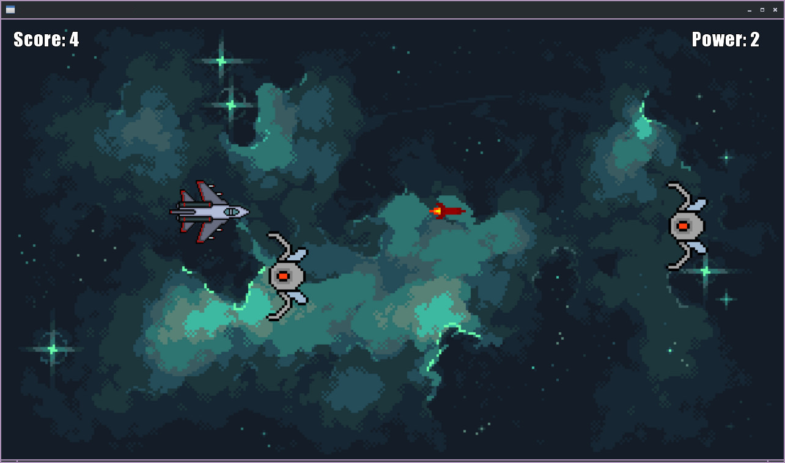

# 🚀 SpaceGDX Jam
> A basic game made with Java and [LibGDX](https://github.com/libgdx/libgdx).

---

# ☕ Game created for LibGDX Jam:
## <https://itch.io/jam/libgdx-jam-27/entries>

---

 

---

# ⚙️  Dependencies
+ [OpenJDK](https://github.com/openjdk)
+ [Gradle](https://github.com/gradle/gradle)

---

# 🎮 How to play
```bash
git clone https://github.com/proxlu/spacegdx-jam
cd spacegdx-jam
gradle run
```

If you are going to build this project, I recommend creating a new project in gdx-setup and pasting
Read this: https://libgdx.com/wiki/start/setup
